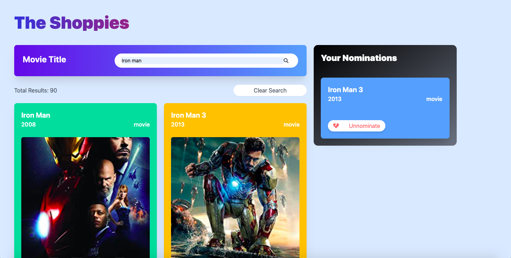

# The Shoppies

Movie award app to manage nominations. Built for the [Shopify Frontend Developer Intern Challenge](https://www.shopify.com/careers/interns#Jobs). Uses the [OMDb API](http://www.omdbapi.com/).

https://the-shoppies-sm.vercel.app/

## Description

This application fetches data from OMDb on the server using next.js API route as proxy. Thus, the API key is no longer accessible through the browser. The search functionality uses a custom hook `useDebounce`, to debounce and trigger the API call 500ms after the user has stopped typing. The user can nominate upto 5 movies after which a banner is shown. The `nominees` state also uses a custom hook `useStickyState`, to set the value of user-selected nominees in a cookie, thus allowing us to persist the data. The movie cards use [`next/image`](https://nextjs.org/blog/next-10#built-in-image-component-and-automatic-image-optimization) for optimized images. Built with accessibility in mind with all interactive elements being keyboard accessible, aptly labelled and colored.

## Tech Used

- [next.js v10 with react v17 and TypeScript](https://nextjs.org/): For features like image optimization out-of-the-box(when hosted with vercel) and API routes which allows us to make sure that our third-party API key is not accessible on the client
- [tailwindCSS v2](https://tailwindcss.com/): For efficient styling and responsiveness. Uses PurgeCSS to purge any unused css
- [js-cookie](https://github.com/js-cookie/js-cookie): To persist data using cookies
- [axios](https://github.com/axios/axios): For requests
- [prettier](https://prettier.io/): For formatting
- [react-icons](https://react-icons.github.io/react-icons/): For icons
- [react-loader-spinner](https://github.com/mhnpd/react-loader-spinner): For a custom loading animation

## Run

- Clone into repo
- Run `yarn` or `npm i`
- Run `touch .env` and copy the contents of `.env-template`
- Get your [OMDb](http://www.omdbapi.com/apikey.aspx) API key and put it in the `.env` file
- Run `yarn dev`

